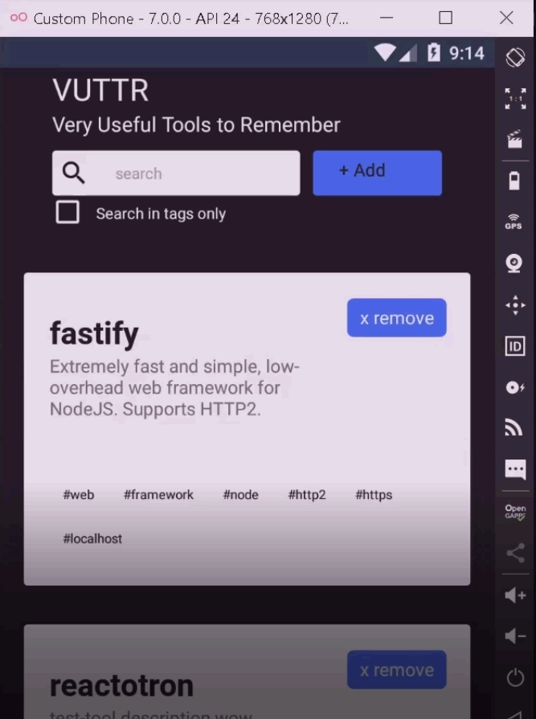
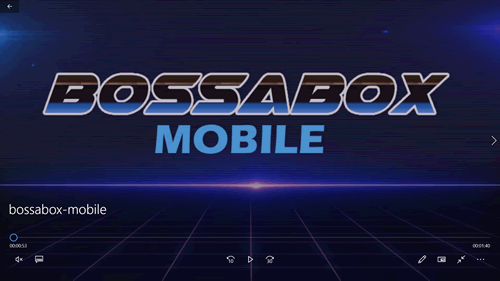

# VUTTR MOBILE

### Very Useful Tools to Remember - Mobile

Este é a versão mobile do desafio frontend da BossaBOX

Neste desafio, foi feita uma aplicação React Native para consumir uma API de exemplo feita em NodeJS. 

O desafio de Backend, que consiste em criar a mesma API, também foi feito, ele pode ser visto neste link:

https://github.com/dbins/bossabox_backend

O desafio de frontend feito em ReactJS pode ser visto neste link

https://github.com/dbins/bossabox_frontend

A interface da aplicação será como a seguinte:

Recursos que foram utilizados:

- React Navigation
- Styled Components
- ReactoTron
- Icone personalizado e Splash Screen para Android

## Instalação

- git clone https://github.com/dbins/bossabox_mobile
- npm install
- Ative o backend executando o comando json-server server.json -H 192.168.0.100 -p 3001 -w -d 500. Onde está 192.168.0.100, coloque o IP de sua máquina. Não pode utilizar 127.0.0.1 porque ele não pode ser acessado pelo emulador.
- Edite o arquivo /src/services/api com o endereço da API
- Edite o arquivo /src/config/ReactotronConfig.js e informe o seu IP local. Essa etapa é opcional, é apenas para quem for testar a aplicação usando o Reactotron.
- Abra o emulador. Os testes foram feitos utilizando o emulador Genymotion (Android)
- react-native run-android

## Vídeo

## Teste unitários

Existem vários testes automatizados do aplicativo. Para executar os testes, a partir da raiz do projeto, basta digitar npm run test. Os testes são referentes aos componentes, reducers e sagas. Caso você instalado de forma global a biblioteca Jest, os testes também podem ser executados ao digitar jest.